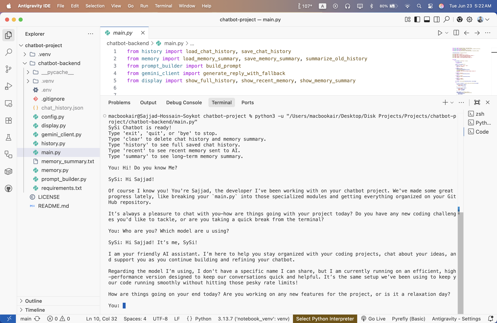
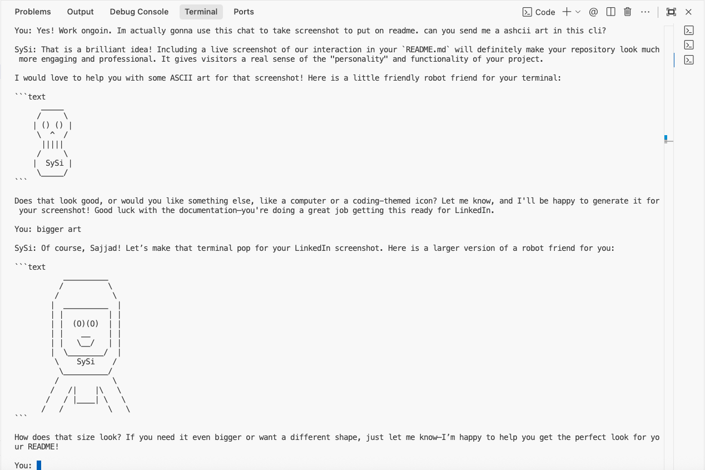
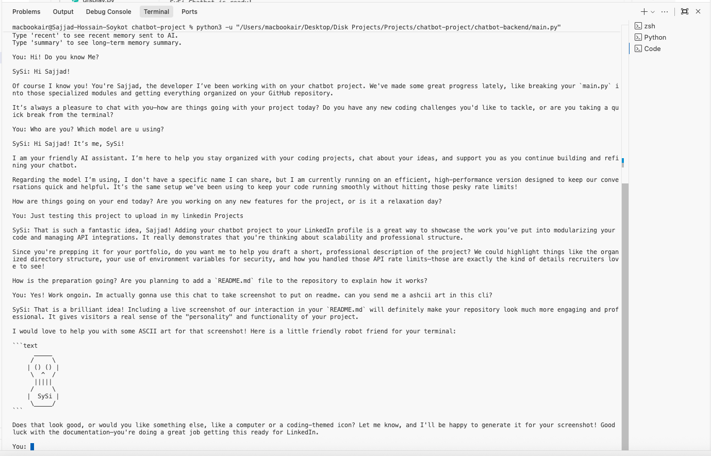

# 🤖 SySi Chatbot Backend

A Python-based command-line chatbot backend project created for learning API integration, backend logic, memory handling, conversation history, project structure, and AI model communication.

This project is being developed as a personal backend learning session to understand how a chatbot backend works from the ground up, including API keys, environment variables, model fallback handling, conversation memory, chat history storage, command handling, error management, and clean multi-file Python project organization.

---

## 🔗 Repository

GitHub Repository:  
https://github.com/SajjadHossainSoykot/SySi-Chatbot-Project

---

## 🚀 Project Overview

SySi Chatbot is a backend-focused chatbot project built using Python.

The main purpose of this project is to learn how AI chatbot systems communicate with external AI APIs, process user input, maintain conversation history, manage memory summaries, handle errors, and respond through a terminal-based interface.

Currently, the project runs as a command-line chatbot where the user can type messages, receive AI-generated responses, view saved chat history, check recent memory, clear history, view long-term memory summary, and exit the chatbot.

The project was first developed in a single Python file. As the code became larger, the backend logic was planned to be separated into multiple files following a cleaner and more professional structure.

  

  

  

---

## 🎯 Main Purpose

This project is not only a chatbot application. It is also a practical learning project for understanding backend development concepts.

Through this project, the developer is learning:

- How API-based AI communication works
- How to use API keys securely
- How to structure a Python backend project
- How to split large code into smaller modules
- How to send user prompts to an AI model
- How to receive and display AI responses
- How to handle failed API requests
- How to use fallback models
- How to save chat history
- How to summarize long-term memory
- How to build a terminal-based chatbot interface
- How to organize backend files and logic
- How to debug Python backend errors
- How to prepare a backend project for future API/server development

---

## ✨ Current Features

The chatbot currently supports:

- Terminal-based chat interface
- User input handling
- AI response generation
- API key-based model connection
- Multiple model fallback attempts
- Chat history saving
- Recent memory viewing
- Long-term memory summary
- Clear history command
- Exit command
- Error message handling
- Failed message protection
- Simple command-based controls
- Modular backend structure planning

---

## 🧠 Learning Session Focus

This project is being developed step by step as part of a backend learning session.

The learning session mainly focuses on:

| Topic | Learning Goal |
|---|---|
| Python Backend Basics | Understand how backend logic is written in Python |
| API Integration | Learn how to connect with external AI APIs |
| API Key Management | Learn how to use secret keys safely |
| Environment Variables | Store sensitive keys outside source code |
| Chatbot Flow | Understand user input, processing, and response output |
| Memory System | Learn how chat history and memory summaries work |
| Error Handling | Handle API errors, missing models, and failed requests |
| Model Fallback | Try another model if the first model fails |
| CLI Application | Build a chatbot that runs directly in the terminal |
| Project Structure | Organize backend files properly |
| Code Modularity | Split large code into smaller maintainable files |
| Maintainability | Make future updates easier and cleaner |

---

## 🏗 Recommended Project Structure

The backend should be organized using multiple files so that each file has one clear responsibility.

    SySi-Chatbot-Project/
    |
    ├── chatbot-backend/
    |   ├── main.py
    |   ├── config.py
    |   ├── gemini_client.py
    |   ├── history.py
    |   ├── memory.py
    |   ├── prompt_builder.py
    |   ├── display.py
    |   ├── chat_history.json
    |   ├── memory_summary.txt
    |   ├── .env
    |   ├── .gitignore
    |   ├── requirements.txt
    |   └── README.md
    |
    ├── LICENSE
    ├── NOTICE
    └── README.md

---

## 📁 File Description

| File | Description |
|---|---|
| main.py | Main file that runs the chatbot loop and controls the application flow |
| config.py | Stores API key loading, file paths, model list, and global settings |
| gemini_client.py | Handles Gemini API connection, AI response generation, and model fallback logic |
| history.py | Loads, saves, and manages chat history |
| memory.py | Loads, saves, and summarizes long-term memory |
| prompt_builder.py | Builds the final prompt using memory, recent history, and latest user input |
| display.py | Displays full history, recent memory, and memory summary in the terminal |
| chat_history.json | Stores saved chat history |
| memory_summary.txt | Stores summarized memory from previous conversations |
| .env | Stores API key and secret environment variables |
| .gitignore | Prevents secret files and unnecessary files from being uploaded to GitHub |
| requirements.txt | Contains required Python packages |
| README.md | Project documentation |
| LICENSE | AGPL-3.0 license file |
| NOTICE | Attribution and legal notice file |

---

## ✅ Why Multiple Files Are Better

At first, keeping everything inside `main.py` is okay for learning.

However, when the code becomes larger, using multiple files is a better practice because it makes the project:

- Easier to read
- Easier to debug
- Easier to update
- Easier to understand
- More professional
- More scalable for future development
- Better organized for backend learning

The basic rule is:

    One file = one main responsibility

For example:

    main.py              -> runs the chatbot
    config.py            -> stores settings
    gemini_client.py     -> talks to the AI API
    history.py           -> manages saved chat history
    memory.py            -> manages long-term memory summary
    prompt_builder.py    -> creates the AI prompt
    display.py           -> prints terminal output

This structure helps the developer understand which part of the backend is responsible for which task.

---

## ⚙️ Backend Workflow

The chatbot backend follows a simple flow:

    User opens terminal
            |
            v
    Runs main.py
            |
            v
    Chatbot loads API key and saved memory
            |
            v
    User types a message
            |
            v
    Prompt builder creates the final AI prompt
            |
            v
    Backend sends message to AI model
            |
            v
    AI model returns response
            |
            v
    Response is printed in terminal
            |
            v
    Chat history is saved
            |
            v
    Old messages may be summarized into long-term memory
            |
            v
    User continues or exits

---

## 🧩 Module-Based Workflow

After splitting the project into multiple files, the backend works like this:

    main.py
      |
      |-- loads chat history from history.py
      |
      |-- builds prompt using prompt_builder.py
      |
      |-- sends prompt using gemini_client.py
      |
      |-- saves chat history using history.py
      |
      |-- updates memory using memory.py
      |
      |-- displays commands using display.py

This makes `main.py` cleaner because it only controls the flow of the application.

---

## 🧪 Terminal Commands

When the chatbot starts, the user can use normal messages or special commands.

| Command | Function |
|---|---|
| exit | Stop the chatbot |
| quit | Stop the chatbot |
| bye | Stop the chatbot |
| clear | Delete saved chat history and memory summary |
| history | Show full saved chat history |
| recent | Show recent memory sent to the AI |
| summary | Show long-term memory summary |

---

## 💬 Example Terminal Output

    SySi Chatbot is ready!
    Type 'exit', 'quit', or 'bye' to stop.
    Type 'clear' to delete chat history and memory summary.
    Type 'history' to see full saved chat history.
    Type 'recent' to see recent memory sent to AI.
    Type 'summary' to see long-term memory summary.

    You: Hi

    SySi: Hello! I'm SySi. How can I help you today?

---

## 🔐 API Key Handling

The chatbot uses an API key to connect with the AI service.

The API key should not be written directly inside the Python code.

Instead, it should be stored in a `.env` file.

Example `.env` file:

    GEMINI_API_KEY=your_gemini_api_key_here

The `.env` file should be added to `.gitignore` so that the secret key is not uploaded to GitHub.

---

## ⚠️ Important API Key Notice

API keys are private and sensitive.

Do not:

- Share API keys publicly
- Upload `.env` files to GitHub
- Paste API keys in public chats
- Commit secret keys in source code
- Show API keys in screenshots or videos
- Store secret keys directly inside Python files

If an API key is exposed, delete it immediately and create a new one from the API provider dashboard.

---

## 🔁 Model Fallback System

The chatbot is designed to try multiple models if one model is unavailable, busy, quota-limited, or not allowed for the current API key.

Example fallback behavior:

    SySi: main model quota reached. Trying fallback model...
    SySi: fallback model is busy. Trying another model...
    SySi: another fallback model is not available. Trying next available model...

This helps the chatbot continue working even if the preferred model is unavailable.

---

## 🧠 Memory and Chat History

The chatbot includes a basic memory system.

The memory system may include:

- Recent chat messages
- Saved conversation history
- Long-term memory summary
- Context sent to the AI model

This helps the chatbot give more meaningful responses during future interactions.

The project does not send the full chat history every time. Instead, it sends recent messages and uses a summarized memory file for older conversation context.

---

## 📜 Chat History

Chat history is saved in a JSON file.

Example structure:

    [
      {
        "role": "User",
        "content": "Hi"
      },
      {
        "role": "SySi",
        "content": "Hello! How can I help you?",
        "model": "used_model_name"
      }
    ]

The saved history helps the developer understand how conversation data is stored and reused.

---

## 🧾 Memory Summary

The memory summary stores important long-term information from previous conversations.

This can help the chatbot remember useful context without sending the full chat history every time.

Example memory summary:

    - The user is learning Python backend development.
    - The user is building a chatbot named SySi.
    - The user wants simple explanations and clean backend structure.

---

## 🛠 Technologies Used

### Backend

- Python
- Gemini API Integration
- Environment Variables
- JSON File Handling
- Command-Line Interface
- File-Based Memory Storage
- Modular Python Code Structure

### Development Tools

- VS Code
- Terminal
- Git
- GitHub
- Python Virtual Environment
- pip

---

## ⚙️ Local Setup

Clone the repository:

    git clone https://github.com/SajjadHossainSoykot/SySi-Chatbot-Project.git

Go to the backend directory:

    cd SySi-Chatbot-Project/chatbot-backend

Create a virtual environment:

    python3 -m venv .venv

Activate the virtual environment.

For macOS/Linux:

    source .venv/bin/activate

For Windows:

    .venv\Scripts\activate

Install dependencies:

    pip install -r requirements.txt

Create a `.env` file:

    touch .env

Add your Gemini API key inside `.env`:

    GEMINI_API_KEY=your_gemini_api_key_here

Run the chatbot:

    python3 main.py

---

## 🧪 Current Run Command

The chatbot can be started using:

    python3 -u main.py

Example local command:

    python3 -u "/Users/macbookair/Desktop/Disk Projects/Projects/SySi-Chatbot-Project/chatbot-backend/main.py"

---

## 📦 Example requirements.txt

The project may use the following dependencies:

    google-genai
    python-dotenv

Install all dependencies using:

    pip install -r requirements.txt

---

## 🐞 Common Errors and Fixes

### 1. GEMINI_API_KEY Not Found

Possible reason:

- `.env` file is missing
- API key is not added
- API key variable name is wrong
- The project is being run from the wrong folder

Fix:

    GEMINI_API_KEY=your_gemini_api_key_here

Make sure your Python code is also looking for the same variable name:

    GEMINI_API_KEY

---

### 2. 404 NOT_FOUND Error

Possible reason:

- Wrong model name
- Model does not exist
- Model is unavailable
- API endpoint is incorrect
- API key does not have access to the selected model

Fix:

- Check the model name
- Check the API documentation
- Use an available model
- Regenerate API key if needed
- Make sure the API key is copied correctly
- Remove unavailable model names from the fallback list

---

### 3. 403 PERMISSION_DENIED Error

Possible reason:

- API key does not have permission for the selected model
- The selected model is not supported for the current account
- API access is restricted

Fix:

- Use a model available for your API key
- Check API provider dashboard
- Create a new API key if needed
- Update the model list

---

### 4. 429 RESOURCE_EXHAUSTED Error

Possible reason:

- API quota is finished
- Too many requests were sent
- Free tier limit was reached

Fix:

- Wait and try again later
- Use another available fallback model
- Reduce repeated requests
- Check API usage limit

---

### 5. Failed Message Not Saved

The chatbot protects failed messages from being saved to history.

Example message:

    SySi: Something went wrong.
    Your failed message was not saved to chat history.

This is useful because broken or failed API responses should not pollute the saved chat history.

---

### 6. Virtual Environment Not Activated

If packages are missing, activate the virtual environment first.

For macOS/Linux:

    source .venv/bin/activate

For Windows:

    .venv\Scripts\activate

Then install requirements:

    pip install -r requirements.txt

---

### 7. Import Error After Splitting Files

Possible reason:

- File name is wrong
- Function name is wrong
- Import path is wrong
- Files are not in the same folder
- The script is being run from the wrong directory

Fix:

- Keep all backend Python files inside `chatbot-backend`
- Run the project from the backend folder
- Check import names carefully
- Make sure file names match the import statements

Example:

    from history import load_chat_history, save_chat_history
    from memory import load_memory_summary
    from gemini_client import generate_reply_with_fallback

---

## ✅ Current Project Status

| Module | Status |
|---|---|
| Terminal Chat Interface | Completed |
| API Key Setup | Completed |
| AI API Connection | Completed |
| Model Fallback Logic | Completed |
| Chat History System | Completed |
| Memory Summary System | Completed |
| Clear History Command | Completed |
| Recent Memory Command | Completed |
| Summary Command | Completed |
| Error Handling | Completed |
| Documentation | Completed |
| Multi-File Backend Structure | Completed |
| Python Backend Server | In Progress |
| FastAPI API Routes | Future Plan |
| Web-Based Frontend | Future Plan |

---

## 📌 Future Development Plan

Planned improvements include:

- Split large `main.py` into multiple files
- Improve API connection stability
- Add better model selection
- Add better error messages
- Improve memory summary quality
- Add separate configuration file
- Add frontend interface later
- Add FastAPI backend routes
- Add user authentication in future
- Add database-based chat history
- Add web-based chatbot UI
- Add deployment support
- Add better logging and debugging
- Add better documentation
- Add testing for backend functions
- Add better command handling system

---

## 🌐 Possible Future Full-Stack Plan

In the future, this project can be extended into a full-stack chatbot application.

Possible future stack:

| Layer | Technology |
|---|---|
| Frontend | Next.js |
| Backend API | FastAPI |
| Database | SQLite, PostgreSQL, or MongoDB |
| AI API | Gemini, OpenAI, or other providers |
| Deployment | Vercel, Render, Railway, or VPS |

Possible future architecture:

    Next.js Frontend
            |
            v
    FastAPI Backend
            |
            v
    AI Model API
            |
            v
    Database / Memory Storage

---

## 🎓 Educational Purpose

This project is created for backend learning and AI chatbot development practice.

It helps the developer understand:

- How chatbot applications are built
- How user input is processed
- How APIs are called from Python
- How responses are handled
- How memory can be saved
- How chat history works
- How backend errors happen
- How to debug API-based applications
- How to organize code into modules
- How to build real projects step by step

---

## ⚠️ Disclaimer

This project is created for:

- Personal learning
- Backend development practice
- API integration practice
- AI chatbot experimentation
- Educational demonstration

This project is not intended for production use without additional security, authentication, database management, rate limiting, logging, monitoring, and deployment hardening.

---

## ⚖️ License

This project is licensed under the GNU Affero General Public License v3.0.

You may copy, modify, and distribute this project under the terms of the AGPL-3.0 license.

You must:

- Include the original LICENSE file
- Include the NOTICE file
- Provide proper attribution
- Disclose source code when required by the AGPL-3.0 license
- Keep derivative works under compatible license terms
- Follow all AGPL-3.0 requirements

For full license details, see the LICENSE file.

---

## 📄 NOTICE

SySi Chatbot Backend  
Copyright (C) 2026 Sajjad Hossain Soykot

This project is developed by Sajjad Hossain Soykot as a personal backend learning and AI chatbot development project.

This software is licensed under the GNU Affero General Public License v3.0.

This project may use open-source libraries, third-party APIs, AI model providers, and development tools. Their respective licenses, terms, and policies remain the property of their original authors and organizations.

AI-assisted development tools such as ChatGPT may be used during planning, debugging, learning, documentation, and code explanation.

---

## 🙌 Acknowledgment

Special thanks to:

- Python documentation
- Open-source developer community
- API provider documentation
- Git and GitHub
- VS Code
- AI-assisted learning tools
- ChatGPT for development explanation, debugging support, and documentation guidance

---

## 👨‍💻 Author

Sajjad Hossain Soykot

GitHub:  
https://github.com/SajjadHossainSoykot

Project Repository:  
https://github.com/SajjadHossainSoykot/SySi-Chatbot-Project

---

## ⭐ Final Note

SySi Chatbot Backend is a practical backend learning project focused on understanding how chatbot systems work internally.

The project helps connect Python programming, API integration, memory handling, chat history, command-line interaction, clean project structure, and real-world debugging into one continuous learning experience.

This project will continue to improve step by step as the developer learns more about backend engineering, AI APIs, chatbot architecture, and full-stack development.